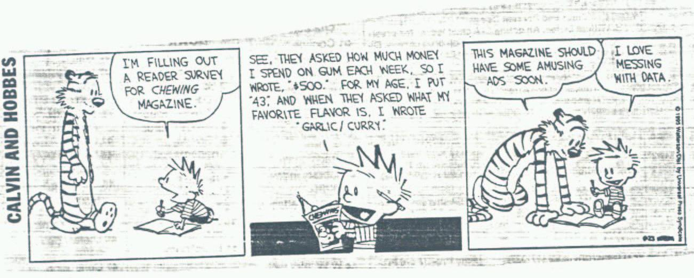
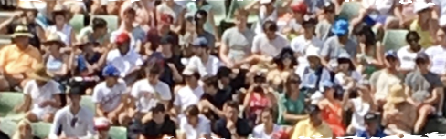
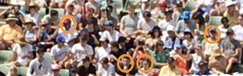
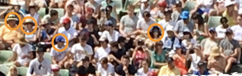
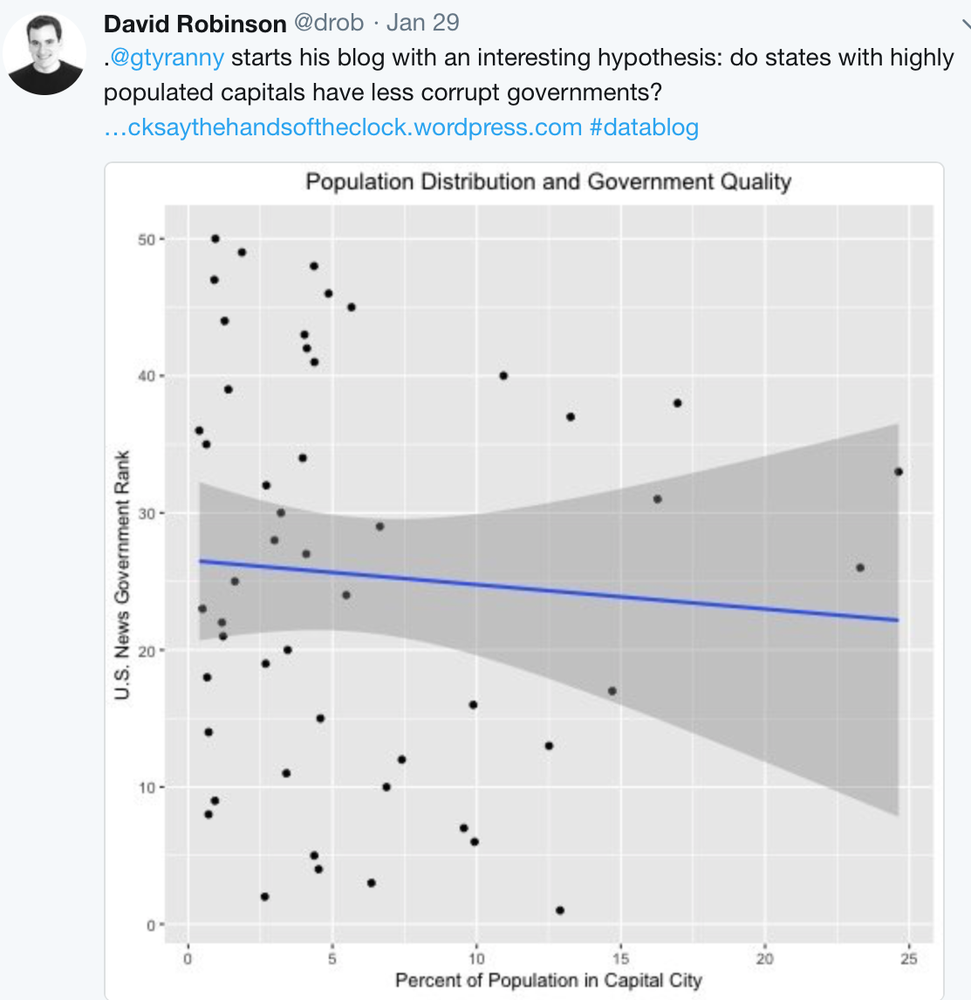

class: inverse middle center

```{r initial, echo = FALSE, cache = FALSE, warning = FALSE, message = FALSE, error=FALSE, results = 'hide'}
library(knitr)
options(htmltools.dir.version = FALSE, tibble.width = 60)
opts_chunk$set(
  echo = FALSE, warning = FALSE, message = FALSE, error=FALSE, comment = "#>",
  fig.path = 'figure/', cache.path = 'cache/', fig.align = 'center', 
  fig.width = 12, fig.height = 11, fig.show = 'hold', 
  cache = TRUE, external = TRUE, dev = 'svglite'
)
library(tidyverse)
library(ochRe)
```

background-image: url(title.png)
background-size: 100%

Source: 

---
class: middle center

# Who uses the tidyverse?


.medium[Tell us why [bit.ly/rstudio-tidyverse](https://public.etherpad-mozilla.org/p/RStudio-tidyverse)]

---

.left-column[


]
.right-column[

# Reported reasons 

Automatic legends, colors, …

The “default” output is much nicer than with base graphics

Combine multiple data sets into a single graph with a snap-together

easy facetting ++

Store any ggplot2 object for modification or future recall.

https://github.com/tidyverse/ggplot2/wiki/Why-use-ggplot2

]


---

# My reasons

.medium[It is also better from a statistics perspective. The grammar of graphics provides a tight connection between data and statistics, in order to do inference with data plots.]

---

# Outline

- How statistics builds on the tidyverse
- Why we need inference
- Some examples
- How do you play with these ideas
- The connection with interactive graphics
- Acknowledgements and references

---
class: middle center

# Tidy data

1. Each variable is in a column
2. Each observation is a row
3. Each value is a cell

<!--




Calvin: *"I'm filling out a reader survey for chewing gum"*

Calvin: *"See, they asked how much I spend on gum per week, so I wrote `$500`. For my age I wrote `43`. And when they asked what my favorite flavor is, I wrote `garlic/curry`."*

Hobbes: *"This magazine should have some interesting ads soon."*

Calvin: *"I love messing with data."*
-->

---
class: middle center

.medium[**Open up an intro statistics textbook...**]

---

class: middle center

background-image: url(img/intro-stats.png)
background-size: 100%

---

class: middle center

.medium[**...and you will find that statistics starts once you have tidy data.**]

---

class: middle center

background-image: url(img/messy_to_tidy1.png)
background-size: 100%

.footnote[Example from Hadley Wickham's workshops]
---

class: middle center

background-image: url(img/messy_to_tidy2.png)
background-size: 100%

---

class: middle center

background-image: url(img/messy_to_tidy3.png)
background-size: 100%

---
# A statistic is a function of the data

For example, the sample mean,

$$\bar{X}=\frac{1}{n}\sum_{i=1}^{n} X_i$$ 

and standard deviation,

$$s_{X}=\sqrt{\frac{1}{n-1}\sum_{i=1}^{n}(X_i-\bar{X})^2}$$

---
class: middle center

# This is what I really like about ggplot2, it makes plots another type of statistic.

---


```{r}
messy_data <- read_csv("data/tb.csv")
tidy_data <- messy_data %>% 
  gather(demo, count, -year, -iso2, na.rm = TRUE) %>% 
  separate(demo, c("gender", "age"))
tidy_data <- tidy_data %>% 
  filter(!(age %in% c("014", "04", "514", "u")))
```

```{r fig.width=10, fig.height=4, echo=TRUE}
tidy_data %>% 
  filter(iso2 == "US") %>% 
  ggplot(aes(x = year, y = count, fill = gender)) +
  geom_bar(stat = "identity", position = "fill") +
  facet_grid(~ age) +
  scale_fill_manual("",
                    values=c(ochre_palettes$lorikeet[1],
                            ochre_palettes$lorikeet[2])) 
```

---

```{r fig.width=10, fig.height=4, echo=TRUE}
tidy_data %>% 
  filter(iso2 == "US") %>% 
  ggplot(aes(x = year, y = count, fill = gender)) +
  geom_bar(stat = "identity") +
  facet_grid(~ age) +
  scale_fill_manual("", 
                    values=c(ochre_palettes$lorikeet[1],
                            ochre_palettes$lorikeet[2])) 
```

---

```{r fig.width=10, fig.height=4, echo=TRUE}
tidy_data %>% 
  filter(iso2 == "US") %>% 
  ggplot(aes(x = year, y = count, fill = gender)) +
  geom_bar(stat = "identity", position="dodge") +
  facet_grid(~ age) +
  scale_fill_manual("", 
                    values=c(ochre_palettes$lorikeet[1],
                            ochre_palettes$lorikeet[2])) 
```

---

```{r fig.width=10, fig.height=4, echo=TRUE}
tidy_data %>% 
  filter(iso2 == "US") %>% 
  ggplot(aes(x = year, y = count, fill = gender)) +
  geom_bar(stat = "identity") +
  facet_grid(gender ~ age) +
  scale_fill_manual("",
                  values=c(ochre_palettes$lorikeet[1],
                          ochre_palettes$lorikeet[2])) 
```

---

```{r fig.width=10, fig.height=4, echo=TRUE}
tidy_data %>% 
  filter(iso2 == "US") %>% 
  ggplot(aes(x = year, y = count, fill = gender)) +
  geom_bar(stat = "identity") +
  facet_grid(gender ~ age) +
  scale_fill_manual("",
                values=c(ochre_palettes$lorikeet[1],
                         ochre_palettes$lorikeet[2])) + 
  coord_polar()
```

---

```{r fig.width=10, fig.height=4, echo=TRUE}
tidy_data %>% 
  filter(iso2 == "US") %>% 
  ggplot(aes(x = year, y = count, fill = gender)) +
  geom_bar(stat = "identity") +
  facet_grid(gender ~ age) +
  scale_fill_manual("", 
                    values=c(ochre_palettes$lorikeet[1],
                          ochre_palettes$lorikeet[2])) + 
  coord_polar()
```

---

```{r fig.width=10, fig.height=6, echo=TRUE}
tidy_data %>% 
  filter(iso2 == "US") %>% 
  ggplot(aes(x = 1, y = count, fill = factor(year))) +
  geom_bar(stat = "identity", position="fill") +
  facet_grid(gender ~ age) +
  scale_fill_ochre("year", palette="lorikeet") +
  theme(legend.position="bottom") 
```

---

```{r fig.width=10, fig.height=6, echo=TRUE}
tidy_data %>% 
  filter(iso2 == "US") %>% 
  ggplot(aes(x = 1, y = count, fill = factor(year))) +
  geom_bar(stat = "identity", position="fill") +
  facet_grid(gender ~ age) +
  scale_fill_ochre("year", palette="lorikeet") +
  coord_polar(theta="y") + theme(legend.position="bottom")
```

---


.footnote[Source: https://www.wired.com/wp-content/uploads/2016/01/DB-Transformation-Colour.gif]

---
class: middle center

# Now we can start doing statistics with plots, actually statistical inference

---

# Population and sample

Inference happens when you have information on a .orange[subset of data], and you want to make statements about the .orange[full set]. Typically, inference is done using the .orange[sample statistics], and what we know about the .orange[behaviour of that statistic] over all possible subsets, of the same size.



---

# Population and sample

Inference happens when you have information on a .orange[subset of data], and you want to make statements about the .orange[full set]. Typically, inference is done using the .orange[sample statistics], and what we know about the .orange[behaviour of that statistic] over all possible subsets, of the same size.



One sample

---

# Population and sample

Inference happens when you have information on a .orange[subset of data], and you want to make statements about the .orange[full set]. Typically, inference is done using the .orange[sample statistics], and what we know about the .orange[behaviour of that statistic] over all possible subsets, of the same size.



Sample again

---
# Population parameters

If we assume that the .orange[population can be described by a distribution], characterized by parameters such as the population mean, $\mu$

and standard deviation, $\sigma$, e.g. the bell curve,

$$N(\mu, \sigma)$$

then the sample statistic behaves nicely, close to the population mean, and closer still when the sample size, $n$ is large. This is parametric statistics. 


---
# Non-parametric

If we .orange[don't want to assume the population has a known distribution], but we'd still like to be able to say something about the population based on the sample at hand, we can use methods like .orange[**bootstrap**] to sample the sample with replacement, or .orange[**permutation**] to break associations between variables. 

The behaviour of the statistic over the bootstrap samples can give us information about the analogous population quantity. And the behaviour of the statistic over permutations shows us what we might expect if there really is no association. 


---
class: middle center

# For plots, we can .orange[compare the data plot] with .orange[null plots] of samples where, by construction, there really is nothing going on. 

---
class: middle center

.medium[**Why do we need inference?**]

---

class: middle center

background-image: url(img/drob_twitter.png)
background-size: 60%

---
# Followed by 

*Below is a simple scatterplot of the two variables of interest. A slight negative slope is observed, but it does not look very large. There are a lot of states whose capitals are less than 5% of the total population. The two outliers are Hawaii (government rank 33 and capital population 25%) and Arizona (government rank 26 and capital population 23%). Without those two the downward trend (an improvement in ranking) would be much stronger.*

*I ran linear regressions of government rank on the percentage of each state’s population living in the capital city, state population (in 100,000s), and state GDP (in $100,000s).... The .orange[coefficient is not significant] for any regression at the traditional 5% level.*

*... .orange[I'm not convinced that the lack of significance is itself significant.]*

.footnote[Analysis in Tick Tock blog, by Graham Tierney.]

---
class: middle center

.medium[Because we make inference with plots anyway, without a firm foundation.]

---
class: middle center

.medium[Let's do some inference....]

# Which one of the following plots shows the strongest relationship between the two variables?

---

class: middle center

background-image: url(img/govt_lineup.png)
background-size: 80%

---
class: middle center

.medium[**Why do we need inference?**]

.footnote[plot number 12]

---
class: middle center

.medium["Spatiotemporal statistics is what happens after all the interesting stuff is done."]

.pull-right[]

.footnote[Heike Hofmann, Statistics, Iowa State University]

---

class: middle center

.medium[**Because then we can make discoveries with graphics and confidently crow about them.**]


---

.left-column[
# Visual inference <br> protocols
]
.right-column[
- **Rorschach protocol**: Before looking at the data, plot a lot of null samples, to get a sense for what might be seen when there really is nothing to be seen.
- **Lineup protocol**: Embed the plot of the data among a field of plots of null samples. Ask someone who's not related to you, to pick the one that's different. If they pick the data plot, this is evidence for the data to have structure that is significantly different from what might be expected by chance.
]

---
.left-column[
# How do you generate null samples?
]
.right-column[
- **Permutation**: Take one of the variables of interest (one columnm of tidy data) and scramble the order. This breaks any association with other variables. 
- **Simulation**: Assume that a variable has values that follow a given statistical distribution. Sample values from this distribution.
]

---
class: middle center

# Putting this all together

---

.left-column[
# When you make a plot of data
]
.right-column[
# think about...
- What is the .orange[question] you are trying the answer from the plot, hence explicitly stating the .orange[null hypothesis and alternative]. 
- How .orange[variables] are mapped to graphical elements.
- What a .orange[null generating mechanism] could be, that woud ensure samples are drawn from a null scenario, of nothing to be seen.
- What are possible .orange[alternative plot designs].
]

---

# Worked examples

- good government
- cancer map
- flying etiquette

---

.pull-left[

]
.pull-right[
- **Question**: Is good government related to population centres?
    - **Null**: Nope
    - **Alternative**: Yes
- Variables mapped to graphical elements
    - x=%Pop, y=Rank, geom=point
    - ......., geom=smooth/lm, se
- Null generating method:
    - Permute x, resulting in *no real association*
- Alternatives: 
    - log the %Pop values
    - No lm, no se
]

---
class: middle center

background-image: url(img/govt_lineup.png)
background-size: 80%

---

.pull-left[
```{r}
library(fiftystater)
library(tidyverse)
library(ochRe)
library(readxl)

incd <- read_xlsx("data/IncRate.xlsx", skip=6, sheet=2) %>%
  filter(!(State %in% c("All U.S. combined", "Kansas"))) %>%
  select(State, `All cancer types combined / Both sexes combined`) %>%
  rename(Incidence=`All cancer types combined / Both sexes combined`) %>%
  mutate(Incidence = as.numeric(substr(Incidence, 1, 5)))

ggplot(incd, aes(map_id = tolower(State))) + 
  # map points to the fifty_states shape data
  geom_map(aes(fill = Incidence), map = fifty_states) + 
  expand_limits(x = fifty_states$long, y = fifty_states$lat) +
  coord_map() +
  scale_x_continuous(breaks = NULL) + 
  scale_y_continuous(breaks = NULL) +
  labs(x = "", y = "") +
  #scale_fill_ochre(palette="jumping_frog", discrete=FALSE) + 
  scale_fill_distiller(palette="YlGn", type="seq", direction=1) +
  theme(legend.position = "bottom", 
        panel.background = element_blank())
```
Cancer incidence across the US 2010-2014, all cancer types, per 100k.

.footnote[Data from American Cancer Society, https://cancerstatisticscenter.cancer.org]
]
.pull-right[

- **Question**: Is there spatial dependency?
    - Null: Nope
    - Alternative: Yep
- Variables mapped to graphical elements
    - x=long, y=lat, geom=map/polygon
    - color=Incidence
- Null generating method:
    - Permute Incidence, breaks any spatial dependence

]

---
class: middle center

# Melanoma

a .orange[different cancer] from what we just looked at, because once you've seen the data its .orange[hard to "unsee it"]

---

```{r}
incd <- read_xlsx("data/IncRate.xlsx", skip=6, sheet=2) %>%
  filter(!(State %in% c("All U.S. combined", "Kansas"))) %>%
  select(State, `Melanoma of the skin / Both sexes combined`) %>%
  rename(Incidence=`Melanoma of the skin / Both sexes combined`) %>%
  mutate(Incidence = as.numeric(substr(Incidence, 1, 3)))

library(nullabor)
pos=7

incd <- incd %>% mutate(State = tolower(State))
incd_lineup <- lineup(null_permute('Incidence'), incd, n=9, pos=pos)
incd_map <- left_join(fifty_states, filter(incd_lineup, .sample==1),
                      by=c("id"="State"))
for (i in 2:9) {
  x <- left_join(fifty_states, filter(incd_lineup, .sample==i),
                      by=c("id"="State"))
  incd_map <- bind_rows(incd_map, x)
}
incd_map <- incd_map %>% filter(!is.na(.sample))
ggplot(incd_map) + 
  geom_polygon(aes(x=long, y=lat, fill = Incidence, group=group)) + 
  expand_limits(x = incd_map$long, y = incd_map$lat) +
  coord_map() +
  scale_x_continuous(breaks = NULL) + 
  scale_y_continuous(breaks = NULL) +
  labs(x = "", y = "") +
  #scale_fill_ochre(palette="jumping_frog", discrete=FALSE) + 
  scale_fill_distiller(palette="YlGn", type="seq", direction=1) +
  theme(legend.position = "bottom", 
        panel.background = element_blank()) +
  facet_wrap(~.sample, ncol=3)
```


```{r eval=FALSE}
incd <- read_xlsx("data/IncRate.xlsx", skip=6, sheet=2) %>%
  filter(!(State %in% c("All U.S. combined", "Kansas"))) %>%
  select(State, `Leukemia / Both sexes combined`) %>%
  rename(Incidence=`Leukemia / Both sexes combined`) %>%
  mutate(Incidence = as.numeric(substr(Incidence, 1, 3)))

library(rgdal)
library(rgeos)
library(ggplot2)
 
us <- readOGR("data/us_states_hexgrid.geojson", "OGRGeoJSON")
centers <- cbind.data.frame(data.frame(gCentroid(us, byid=TRUE), id=us@data$iso3166_2))
 
us_map <- fortify(us, region="iso3166_2")

incd %>% filter(tolower(State) %in% fifty_states$id) -> incd50

pos=2
incd_lineup <- lineup(null_permute('Incidence'), incd50, n=9, pos=pos)

us@data$`google_name` <- tolower(gsub("\\s*\\([^\\)]+\\)","",us@data$`google_name`))

hexdata <- filter(incd_lineup, .sample==1) %>% #select(State, Incidence) %>%
  full_join(., us@data, by=c("State"="google_name")) 
for (i in 2:9) {
  x <- full_join(filter(incd_lineup, .sample==i),
                      us@data, by=c("State"="google_name"))
  hexdata <- bind_rows(hexdata, x)
}
hexdata <- hexdata %>% filter(!is.na(.sample))

ggplot() + geom_map(data=us_map, map=us_map,
                    aes(x=long, y=lat, map_id=id),
                    color="white", size=0.5) + 
  geom_map(data=hexdata, map=us_map,
                    aes(fill=Incidence, map_id=iso3166_2)) +
  geom_map(data=us@data, map=us_map,
                    aes(map_id=iso3166_2),
                    fill="#ffffff", alpha=0, color="white") + #geom_text(data=centers, aes(label=id, x=x, y=y), color="white", size=4) +
  scale_fill_distiller(palette="YlGn", na.value="#7f7f7f") + coord_map() +
  labs(x=NULL, y=NULL) + theme_bw() + theme(panel.border=element_blank()) +
  theme(panel.grid=element_blank()) + theme(axis.text=element_blank()) +
  facet_wrap(~.sample)

```

---
class: middle center 

[41% Of Fliers Think You’re Rude If You Recline Your Seat](http://fivethirtyeight.com/datalab/airplane-etiquette-recline-seat/)

FiveThirtyEight article by Walt Hickey, Sep 2014

---

```{r fig.height=10, fig.width=12}
fly <- read_csv("data/flying-etiquette.csv")
fly <- fly %>% rename(`how_often`=`How often do you travel by plane?`,
                      `recline`=`Do you ever recline your seat when you fly?`,
                      `baby_rude`=`In general, is itrude to bring a baby on a plane?`,
                      age=Age, gender=Gender)
fly_sub <- fly %>% filter(`how_often` %in% 
     c("Once a year or less","Once a month or less")) %>%
  filter(!is.na(`recline`)) %>%
  filter(!is.na(`baby_rude`)) %>%
  filter(!is.na(age)) %>% 
  filter(!is.na(gender))
fly_sub$recline <- factor(
  fly_sub$recline, levels=c(
    "Never","Once in a while","About half the time",
    "Usually","Always"))
fly_sub$age <- factor(fly_sub$age, levels=c("18-29","30-44","45-60","> 60"))
fly_sub$gender <- as.numeric(factor(fly_sub$gender, levels=c("Male","Female"), labels=c(0,1))) - 1

pos=12

set.seed(12)
fly_sub_lineup <- lineup(null_dist(var="gender", dist="binomial", 
                                   params=list(p=0.533, n=809, size=1)), 
                         fly_sub, pos=pos, n=12)
fly_sub_lineup$gender <- factor(fly_sub_lineup$gender, 
                                levels=c(0,1), labels=c("male", "female"))
ggplot(fly_sub_lineup, 
       aes(x=`baby_rude`, fill=gender)) + 
  xlab("Is it rude to bring a baby on board?") +
  geom_bar(position="fill") + coord_flip() +
  scale_fill_manual("", 
                    values=c(ochre_palettes$lorikeet[2],
                          ochre_palettes$lorikeet[1])) +
  facet_wrap(~.sample, ncol=4)
```

---

background-image: url(img/hyptesting.pdf)
background-size: 90%


---
class: center middle

# Interesting tidbit

The first lineup was done by Neyman, Scott and Shane (1953) to examine the universe .orange["If one actually distributed the cluster centres in space and then
placed the galaxies in the clusters exactly as prescribed by the
model, would the resulting picture on the photographic plate look
anything like that on an actual plate...?"]

.footnote[The hard work was of course done by .orange[Computers], consisting of an office with three female assistants whose work was acknowledged as requiring a tremendous amount of care and attention.]
---

# p-values 

The *p*-value is the probability that the data plot is extreme, if there really is no structure in the population. **The lower the better!**

```{r echo=TRUE}
library(nullabor)
data(turk_results)
turk_results %>% filter(pic_id == "105") %>% count(detected)
pvisual(13, 17)
```

---

# p-values 

```{r echo=TRUE}
turk_results %>% filter(pic_id == "116") %>% count(detected)
pvisual(2, 16)
```

---
# Our trial

.pull-left[
```{r}
ggplot(fly_sub_lineup, 
       aes(x=`baby_rude`, fill=gender)) + 
  xlab("Is it rude to bring a baby on board?") +
  geom_bar(position="fill") + coord_flip() +
  scale_fill_manual("", 
                    values=c(ochre_palettes$lorikeet[1],
                          ochre_palettes$lorikeet[2])) +
  facet_wrap(~.sample, ncol=4)
```
]
.pull-right[
```{r echo=TRUE}
pvisual(20, 50)
```
]

.footnote[run directly in R]
---
# ...and power

Power is the probability that the data plot is detected when there really is some structure in the population. **The higher the better!**

```{r echo=TRUE}
visual_power(turk_results)
```

---

.pull-left[
```{r}
ggplot(fly_sub_lineup, 
       aes(x=`baby_rude`, fill=gender)) + 
  xlab("Is it rude to bring a baby on board?") +
  geom_bar(position="fill") + coord_flip() +
  scale_fill_manual("", 
                    values=c(ochre_palettes$lorikeet[1],
                          ochre_palettes$lorikeet[2])) +
  facet_wrap(~.sample, ncol=4)
```
]
.pull-right[
```{r}
ggplot(fly_sub_lineup, 
       aes(x=`baby_rude`, fill=gender)) + 
  xlab("Is it rude to bring a baby on board?") +
  geom_bar() + coord_flip() +
  scale_fill_manual("", 
                    values=c(ochre_palettes$lorikeet[1],
                          ochre_palettes$lorikeet[2])) +
  facet_wrap(~.sample, ncol=4) 
```
]

Best design to answer this question: "Do males and females perceive the etiquette of bringing a baby on board differently?"

.footnote[Hofmann et al (2012) InfoVis]

---

.pull-left[

]
.pull-right[
Hypothesis testing provides rigor to data analysis. Its very important to do it rigorously. 

.orange[**The hypothesis for data plots comes from the type of plot being used.**] 

When you add the data to the plot, it becomes a test statistic. Hypotheses never come from looking at the data first, but from the underlying problem to be solved.
]

---
# The nullabor package

```{r echo=TRUE, message=TRUE}
fly_sub_lineup <- lineup(
  null_dist(var="gender", dist="binomial", 
             params=list(p=0.533, n=809, size=1)), 
  fly_sub, n=12)
```

.footnote[https://github.com/dicook/nullabor]

---
background-image: url(img/andreas.png)
background-size: 70%

# Inference and interactive graphics

.pull-left[The 1980s dataviewer interactive graphics software by Buja, Hurley, Stuetzle, McDonald

http://stat-graphics.org/movies/dataviewer.html

had tools to compare data plots with null plots!

]

---
class: center middle

But equally important, the interactive graphics system was built on a .orange[data pipeline] in which the data played the central engine.


.footnote[Xie et al (2014) Statistical Science]
---
# Summary

- Tidy data provides the glue from raw data to the data in the statistics textbooks 
    - it fills that vast chasm that has existed and exasperated for eons.
    - No longer do statisticians have to request the clean tabular format csv file before they can get started
    
---
# Summary
    
- The grammar of graphics provides the functional mapping of variable to plot element that makes data plots become statistics that we can do inference on
    - Visual inference protocol gives some "teeth" to the discoveries 
    - ... and helps to avoid apophenia
    - Prevents *p*-hacking and supports practical significance
- Think about interactive graphics and inference procedures as part of the data pipeline

---

class: inverse 

# Joint work!

- Inference: Andreas Buja, Heike Hofmann, Mahbub Majumder, Hadley Wickham, Eric Hare, Susan Vanderplas, Niladri Roy Chowdhury, Nat Tomasetti.
- Interactive graphics: Debby Swayne, Andreas Buja, Duncan Temple Lang, Heike Hofmann, Michael Lawrence, Hadley Wickham, Yihui Xie, Xiaoyue Cheng.

Contact: [`r icon::fa_envelope()`](http://www.dicook.org) dicook@monash.edu, [`r icon::fa_twitter()`](https://twitter.com/visnut) visnut, [`r icon::fa_github()`](https://github.com/dicook) dicook

.footnote[Slides made with Rmarkdown, xaringan package by Yihui Xie, and lorikeet theme using the [ochRe package](https://github.com/ropenscilabs/ochRe). Available at [github.com/dicook/RStudio-keynote](github.com/dicook/RStudio-keynote].)

---
# Further reading

- Inference
    - Buja et al (2009) Statistical Inference for Exploratory Data Analysis and Model Diagnostics, Roy. Soc. Ph. Tr., A
    - Majumder et al (2013) Validation of Visual Statistical Inference, Applied to Linear Models, JASA
    - Wickham et al (2010) Graphical Inference for Infovis, InfoVis, Best paper
    - Hofmann et al (2012) Graphical Tests for Power Comparison of Competing Design, InfoVis
    
---

- Interactive graphics
    - Buja et al (1987) Elements of a Viewing Data Pipeline for Data Analysis and  [Dataviewer](http://stat-graphics.org/movies/dataviewer.html)
    - Cook and Swayne (2007) [Interactive and Dynamic Graphics for Data Analysis](ggobi.org)
    - Wickham et al (2009?) [The plumbing of interactive graphics
](http://vita.had.co.nz/papers/plumbing.pdf)
    - Xie et al (2014) Reactive Programming for Interactive Graphics, Statistical Science

---
class: middle center

<a rel="license" href="http://creativecommons.org/licenses/by-sa/4.0/"></a><br />This work is licensed under a <a rel="license" href="http://creativecommons.org/licenses/by-sa/4.0/">Creative Commons Attribution-ShareAlike 4.0 International License</a>.

